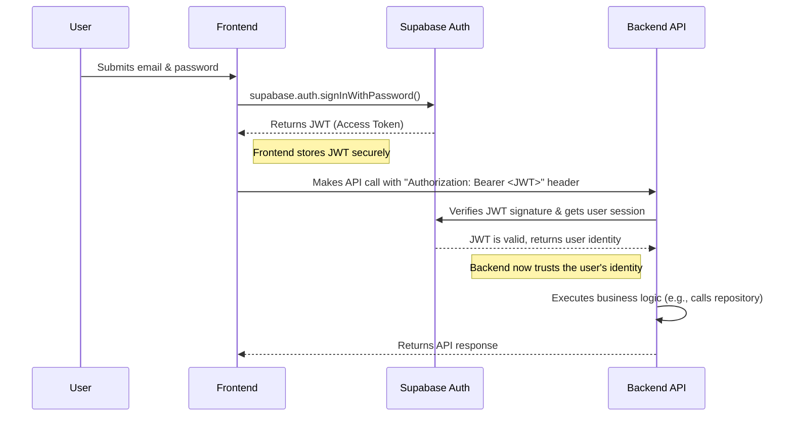

# Backend Architecture

This section details the structure and patterns for the backend, which will be implemented using Next.js API Routes.

### Service Architecture (Serverless)

We will follow the file-system based routing conventions of Next.js for our API. This is a serverless approach, where each API route is a self-contained function.

**Function Organization:**
The API routes will be organized by resource within the `src/app/api/` directory.

```text
src/app/api/
├── products/
│   ├── route.ts        # Handles GET (list) and POST (create) for /api/products
│   └── [productId]/
│       └── route.ts    # Handles GET (one), PUT, DELETE for /api/products/{productId}
├── sales/
│   └── route.ts        # Handles POST for /api/sales
└── stores/
    └── route.ts
```

### Database Architecture

- **Schema Design:** The database schema is defined in the "Database Schema" section above, using PostgreSQL DDL and leveraging Supabase's Row-Level Security for data isolation.
- **Data Access Layer:** We will implement the **Repository Pattern**. For each core data model (e.g., `Product`), a corresponding repository class (e.g., `ProductRepository`) will be created. This class will encapsulate all the database query logic (SQL) for that model. The API route handlers will use these repositories to interact with the database, keeping the route handlers clean and separating business logic from data access concerns.

### Authentication and Authorization

- **Authentication Flow:** Authentication will be handled by Supabase Auth. The client-side frontend will interact with Supabase directly to sign users in and get a JSON Web Token (JWT). This JWT will then be sent with every API request to the backend.
- **Authorization:** The backend will verify the JWT on every protected API request. Authorization logic (i.e., what a user is *allowed* to do) will be enforced at two levels:
    1.  **API Route Middleware:** Middleware can check for high-level roles (e.g., is the user an 'owner'?)
    2.  **Database (RLS):** Row-Level Security policies in the database provide the ultimate guarantee that a user can only ever access data from their own store.

**Auth Flow Diagram:**

