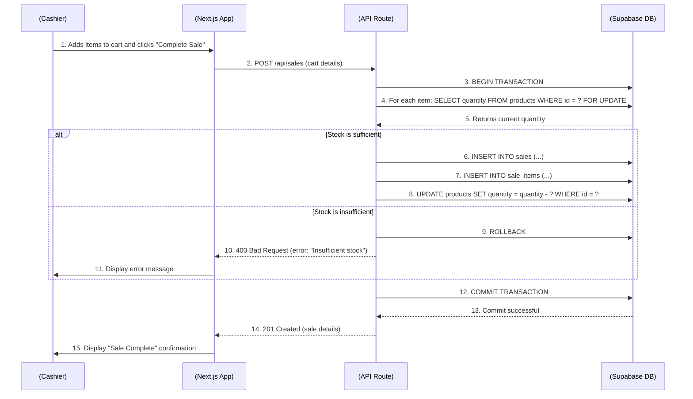

# Core Workflows

This section uses sequence diagrams to illustrate critical user journeys. Here is the workflow for an in-store Point of Sale (POS) transaction.

```mermaid
sequenceDiagram
    participant User as (Cashier)
    participant Frontend as (Next.js App)
    participant Backend as (API Route)
    participant DB as (Supabase DB)

    User->>Frontend: 1. Adds items to cart and clicks "Complete Sale"
    Frontend->>Backend: 2. POST /api/sales (cart details)
    Backend->>DB: 3. BEGIN TRANSACTION
    Backend->>DB: 4. For each item: SELECT quantity FROM products WHERE id = ? FOR UPDATE
    DB-->>Backend: 5. Returns current quantity
    alt Stock is sufficient
        Backend->>DB: 6. INSERT INTO sales (...)
        Backend->>DB: 7. INSERT INTO sale_items (...)
        Backend->>DB: 8. UPDATE products SET quantity = quantity - ? WHERE id = ?
    else Stock is insufficient
        Backend->>DB: 9. ROLLBACK
        Backend-->>Frontend: 10. 400 Bad Request (error: "Insufficient stock")
        Frontend->>User: 11. Display error message
        end
    Backend->>DB: 12. COMMIT TRANSACTION
    DB-->>Backend: 13. Commit successful
    Backend-->>Frontend: 14. 201 Created (sale details)
    Frontend->>User: 15. Display "Sale Complete" confirmation
```
