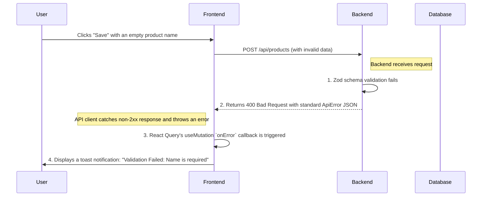

# Error Handling Strategy

This section defines a consistent approach to error handling across the entire full-stack application, from the database to the UI.

### Error Flow

This diagram shows how a typical validation error flows through the system.



### Error Response Format

All errors returned from the backend API **must** conform to the following JSON structure.

```typescript
interface ApiError {
  error: {
    code: string; // A machine-readable error code (e.g., 'validation_error', 'not_found')
    message: string; // A human-readable error message
    details?: Record<string, any>; // Optional structured data, like Zod validation issues
    timestamp: string; // ISO 8601 timestamp of the error
    requestId: string; // A unique ID for tracing the request
  };
}
```

### Frontend Error Handling

The frontend will handle API errors gracefully within the data fetching layer.

```typescript
// Example using React Query
const { mutate, error } = useMutation({
  mutationFn: (newProduct: Product) => apiClient.post('/products', newProduct),
  onSuccess: () => {
    // Invalidate and refetch
  },
  onError: (error: ApiError) => {
    // Display a toast notification to the user
    toast.error(`Error: ${error.error.message}`);
  },
});
```

### Backend Error Handling

A centralized error handling middleware will be used to wrap all API route handlers. This ensures all responses are consistent.

```typescript
// Conceptual middleware for an API route
function withErrorHandler(handler) {
  return async (req, res) => {
    try {
      await handler(req, res);
    } catch (error) {
      const apiError = formatError(error); // Formats the error into the standard ApiError shape
      return new Response(JSON.stringify(apiError), {
        status: apiError.error.statusCode || 500,
        headers: { 'Content-Type': 'application/json' },
      });
    }
  };
}
```
