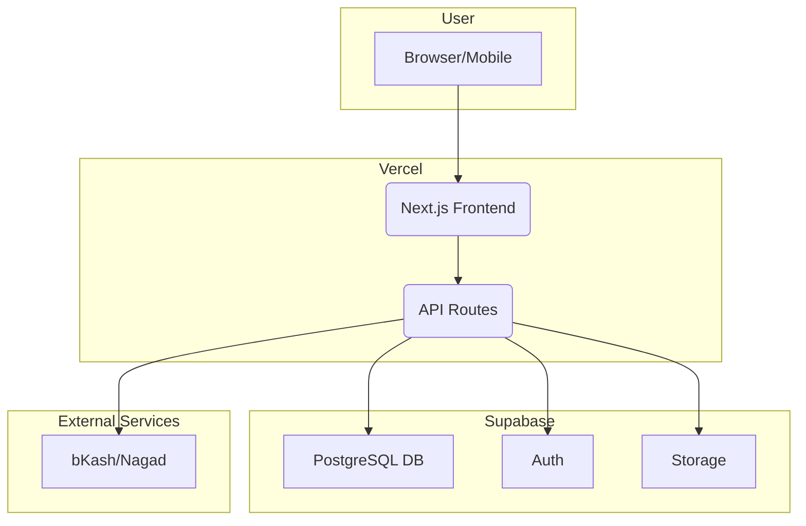

# High Level Architecture

### Technical Summary

This architecture outlines a modern, scalable, and maintainable full-stack solution for the "SaaS Platform for Grocery Shops". It is designed as a modular monolith, leveraging a serverless-first approach for the backend and a component-based, single-page application for the frontend. The key integration point is a REST API. The entire system will be hosted on a major cloud platform to ensure scalability and reliability, directly supporting the PRD's goals of a robust and scalable platform.

### Platform and Infrastructure Choice

**Platform:** Vercel + Supabase
**Key Services:** Vercel (Hosting, CDN), Supabase (PostgreSQL, Auth, Storage)
**Deployment Host and Regions:** Vercel Edge Network (Global), Supabase (nearest region to Bangladesh)

### Repository Structure

**Structure:** Monorepo
**Monorepo Tool:** npm workspaces
**Package Organization:**
- `apps/web`: The Next.js frontend application.
- `apps/api`: The backend API (e.g., Express.js or Next.js API routes).
- `packages/shared`: Shared code, such as TypeScript types and validation schemas.
- `packages/ui`: Shared UI components.

### High Level Architecture Diagram

### Architectural Patterns

-   **Jamstack Architecture:** The frontend will be a static or server-rendered application, consuming APIs for dynamic functionality. _Rationale:_ Optimal performance, scalability, and security.
-   **Component-Based UI:** The frontend will be built with reusable React components. _Rationale:_ Maintainability, consistency, and reusability.
-   **Repository Pattern:** The backend will use a repository pattern to abstract data access logic. _Rationale:_ Decouples business logic from data sources, improving testability and flexibility.
-   **API Gateway Pattern:** All API requests will be routed through a single gateway (Vercel's API routes). _Rationale:_ Centralized point for routing, authentication, and logging.
